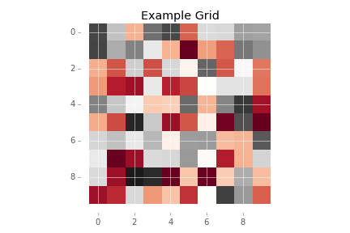

## Track Generation:

For this project we developed a couple of scripts to create tracks, the tracks comprise of some obstacles that can either protrude from the ceiling of the track or upwards from the floor. To implement this, we first generate a random number of tuples which contain four attributes; width and height of the obstacles, starting location in the window and if it is on the ceiling or floor of the window. The set of tuples that are generated can then be made into windows, where a window will contain one obstacle.



To create the track, a random number of windows are then selected, trimmed and concatenated to make a track. At the window generation phase, the window is initially created with zeros and ones where ones are the obstacle. We then fill the zeros in with a function (```x**2 + 2 * y**2```) to generate a continuous value, which are then be binned into seven distinct bins which correspond to different actions of the wind.

There are two files that can be used to generate tracks - with and without wind is possible.

    /Model/Build_tracks.py
    /Model/Build_tracks_wind.py

These python scripts simply calling the classes contained within the following files to get the respective tracks.

    /Model/Generate_obstacles.py
    /Model/Wind_Generation.py

## Agent

    /Model/Agent.py

This file contains the mapping for action to location update with respect to the world. There are two functions:

1.  Action Controller : this controls the behaviour of the Agent that it has the ability to change
2.  Wind Controller : dependinng on the location (x, y) that the Agent is currently at dictates the resulting action of the Agent. The Q-values that are calculate are independent of this Controller.

## Q-Learning Classes

    /Model/Q_Learning_Agent.py

Within this file there are 3 classes - one per type of model. At the heart of all three classes is there Q-Learning function.

    def learnQ(self, state, action, reward, value):

        old_value = self.q.get((state, action), None)

        if old_value is None:
            self.q[(state, action)] = reward

        else:
            self.q[(state, action)] = old_value + \
                self.alpha * (value - old_value)

The three models are:

    1. e-Greedy Q Learning (1)
    2. e-Greedy Q-Learning with e-decay (2)
    3. Deep Q-Network (*DQN*)(3)

### Model: e-Greedy Q Learning

Both models make use of a python dictionary in order to map State-Action pairs to rewards. By using this method as opposed to a pre-computed table is that there was no startup cost associated with calculating them inadvance of training the model.

The primary disadvantage is that if the model was used in a predictive state and the Agent had not seen a particular pair before then it's performance with regards to the optimal policy be terrible. It would therefore be deemed that the model is generalising poorly - it would be hoped that in the finite state space that the model is learning that this would not be the case.

### Model: Deep Q-Network (*DQN*)

Model 3 uses a Neural Network to Approximate the Q-Values - alot of motivation has been taken from the work of Deepmind. A number of their notes in their papers have been included in the build of the model, most notably the use of experiance.

In order to collect a set amount of history (experiances) the model uses a Epsilon Greedy strategy to select at random an action. The resulting state, reward and action are recorded in within the memory of the Agent. *Where a memory refers to an array.* This array maintains a set size - new items replace the oldest values. It is expected that this process would be beneficial to the model for it to improve more quickly over time, that is if the model is capable of learning.

## Challenges and Issues Resolved

The majority of challenges there were faced during the build were with the DQN.

Challenges:

*   Encouraging the model to learn - both the traditional Q-Learning models did not find it too difficult to find the optimal policy. In stark contrast the DQN model did!
*   Finding the right starting hyper parameters for the Neural Network
    *   From the first build it was found that the model was very sensitive to the Learning Rate, size of rewards and the Epsilon
*   Abstraction - there are a number of scripts now that are used which may cause confusion
*   Architecture - I really wanted to use RNN for this model. Given that this was a University project in Software Agents and not Deep Learning I was not able to resolve or understand why they were so hard to get to work.

Resolution:

*   Random Starting location during the training phase - particularly useful for DQN!
*   Sadly there there was no strategy - experimented alot. One tip which I didn't do initially was to use a systematic approach, I would even go as far as to suggest advising the use of Grid Search.
*   Since there are no deadlines - the intention it to resolve the code issues (starting for a fresh), adding a variety of new models and get a model working with RNN's!

I'll add more this in due course.

